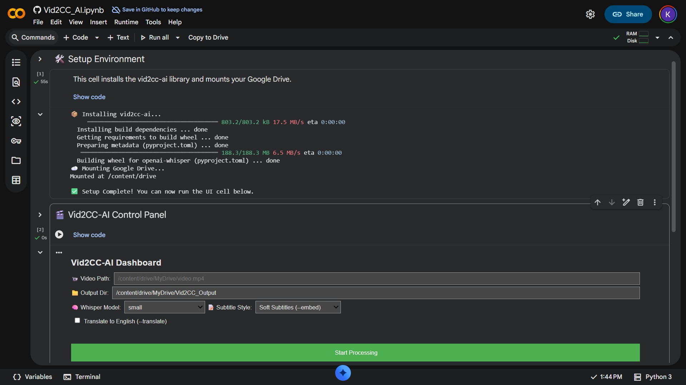

# vid2cc-AI 🎙️🎬

[](https://pypi.org/project/vid2cc-ai/)
[](https://opensource.org/licenses/MIT)
[](https://www.python.org/downloads/)
[](https://github.com/psf/black)


**vid2cc-AI** is a high-performance CLI tool designed to bridge the gap between raw video and accessible content. By leveraging OpenAI's Whisper models and FFmpeg's robust media handling, it automates the creation of perfectly synced `.srt` subtitles.

---

## Table of contents

- [🚀 Key Features](#-key-features)
- [⚙️ Installation](#-installation)
  - [1. Prerequisite: FFmpeg](#1-prerequisite-ffmpeg)
  - [2. Install vid2cc-AI](#2-install-vid2cc-ai)
- [📖 How To Use](#-how-to-use)
  - [🛠️ Advanced Options](#-advanced-options)
  - [📦 Batch Processing](#-batch-processing)
  - [📦 Usage as a Library](#-usage-as-a-library)
- [☁️ Run on Google Colab (with UI)](#run-on-google-colab-with-ui)
- [🧪 Testing](#-testing)
- [🗺️ Roadmap](#-roadmap)
- [🛠️ Tech Stack](#-tech-stack)
- [📄 License](#-license)

---

## 🚀 Key Features

- **AI-Driven Transcription:** Powered by OpenAI Whisper for industry-leading accuracy.
- **Hardware Acceleration:** Automatic CUDA detection for GPU-accelerated processing.
- **Intelligent Pre-processing:** FFmpeg-based audio extraction optimized for speech recognition (16kHz Mono).
- **Professional Packaging:** Fully installable via pip with a dedicated command-line entry point.

---

## ⚙️ Installation

### 1. Prerequisite: FFmpeg

This tool requires **FFmpeg** to be installed on your system. 

For a complete step-by-step guide on how to install FFmpeg on Windows (Winget/Choco), macOS (Homebrew), or Linux (Apt/Dnf/Pacman), please refer to the dedicated guide:

👉 **[FFmpeg Installation Guide](./ffmpeg_installation.md)**

### 2. Install vid2cc-AI

```bash
pip install vid2cc-ai
```

 **Install directly from the source for development:*

```bash
git clone https://github.com/0xdilshan/vid2cc-AI.git
cd vid2cc-AI
pip install -e .
```

## 📖 How To Use

Once installed, the `vid2cc` command is available globally in your terminal.

#### Examples

*For maximum accuracy with toggleable subs:*

```bash
vid2cc example.mp4 --model large --embed
```

---

### 🛠️ Advanced Options

Fine-tune your output using the following flags:

| Flag | Description |
| :--- | :--- |
| `--model [size]` | **Choose Whisper model:** `tiny`, `base`, `small`, `medium`, `large` or `turbo`. |
| `--embed` | **Soft Subtitles:** Adds the SRT as a metadata track. Fast and allows users to toggle subtitles on/off in players like VLC. |
| `--hardcode` | **Burn-in Subtitles:** Permanently draws subtitles onto the video. Essential for social media (Instagram/TikTok) where players don't support SRT files. |
| `--output-dir` or `-o` | **Set Output Directory:** Create the destination directory if it doesn't exist and ensure all generated files (SRT, audio, and video) are saved there. |
| `--translate` or `-t` | **Translate to English:** Automatically translate any supported language transcription to English |

### 📦 Batch Processing
No need to run the command for every single file. You can pass multiple videos at once:

```bash
# Process all mp4 files in the current directory
vid2cc *.mp4 --model small --embed

# Process multiple specific files
vid2cc video1.mp4 video2.mkv video3.mov --model base --embed
```

---

### 📦 Usage as a Library

You can integrate **vid2cc-AI** directly into your Python projects:

```python
from vid2cc_ai import Transcriber, extract_audio

# Extract and Transcribe
extract_audio("video.mp4", "audio.wav")
ts = Transcriber("base")
segments = ts.transcribe("audio.wav")

for s in segments:
    print(f"[{s['start']:.2f}s] {s['text']}")
```

---

## Run on Google Colab (with UI)

You can run vid2cc-ai directly in your browser using Google Colab. This version includes a friendly interface to manage your Google Drive files and transcription settings without writing code.

1. **Open the Notebook:** [](https://colab.research.google.com/github/0xdilshan/vid2cc-AI/blob/main/Vid2CC_AI.ipynb).
2. **Install & Mount:** Run the first cell to install `vid2cc-ai` and connect your Google Drive.
3. **Configure UI:** * **Video Path:** Right-click your video in the Colab file sidebar and select "Copy Path."

   - **Model:** Choose `turbo` or `small` for speed, large for accuracy.
   - **Output:** Select if you want Soft Subtitles (toggleable) or Hardcoded (burned-in).

4. **Start:** Click **"Start Processing"** and find your result in your Drive folder.

⚡ For 10x faster transcription, ensure your Colab runtime is set to GPU (`Runtime` > `Change runtime type` > `T4 GPU`).

[](https://colab.research.google.com/github/0xdilshan/vid2cc-AI/blob/main/Vid2CC_AI.ipynb)

---

## 🧪 Testing


```bash
# Install test dependencies
pip install pytest

# Run the test suite
pytest
```


---

## 🗺️ Roadmap

- [x] Local video → SRT subtitle/ transcription
- [x] Embed subtitles into video containers (`--embed`)
- [x] Burn-in subtitles (`--hardcode`)
- [x] Set custom output directory (`--output-dir`)
- [x] Multilingual transcription
- [x] Support translation to English
- ~~[ ] Transcription from YouTube/Vimeo URLs (`yt-dlp`)~~
- [x] Google Colab notebook support

---

## 🛠️ Tech Stack

- **Inference:** OpenAI Whisper
- **Media Engine:** FFmpeg
- **Core:** Python 3.9+, PyTorch
- **CLI Framework:** Argparse

---

## 📄 License

Distributed under the MIT License.  
See `LICENSE` for more information.